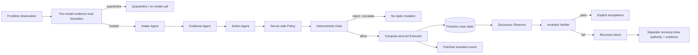

# FlowBound Architecture

## Responsibility split

| Component | Responsibility |
| --- | --- |
| Evidence trust boundary | Stops configured hostile/instruction-like evidence before model invocation and records provenance. |
| Gemini + Google ADK | Interprets observations and produces a structured named-effect proposal. |
| FlowBound Policy | Owns legal predecessors, required authorities, human-approval rules, and successor states. |
| Deterministic Gate | Decides ALLOW, REJECT, ESCALATE, or QUARANTINE. |
| Firestore transaction | Applies the exact authorized successor only if the predecessor revision is still current. |
| Successor Observer + Verifier | Re-reads resulting state and compares it with the policy-derived postcondition. |
| Pub/Sub | Emits transition lineage asynchronously. |
| Recovery boundary | Keeps failed transitions blocked until a separately authorized evidence-backed recovery clears them. |

## Core invariant

Reasoning may be probabilistic; consequential state changes are not. A model proposal never carries its own authority, successor state, or proof of success.